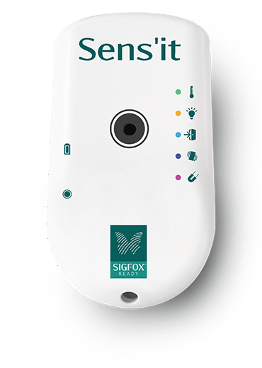
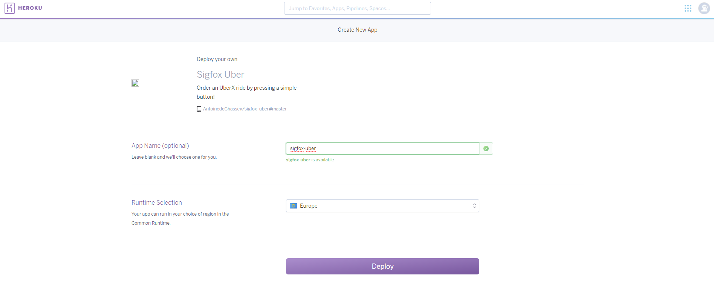
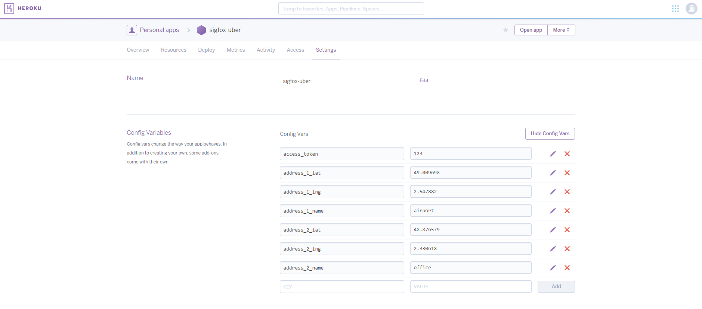
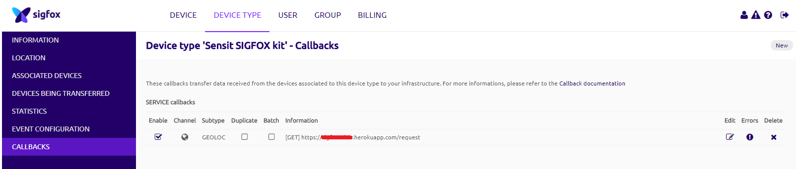
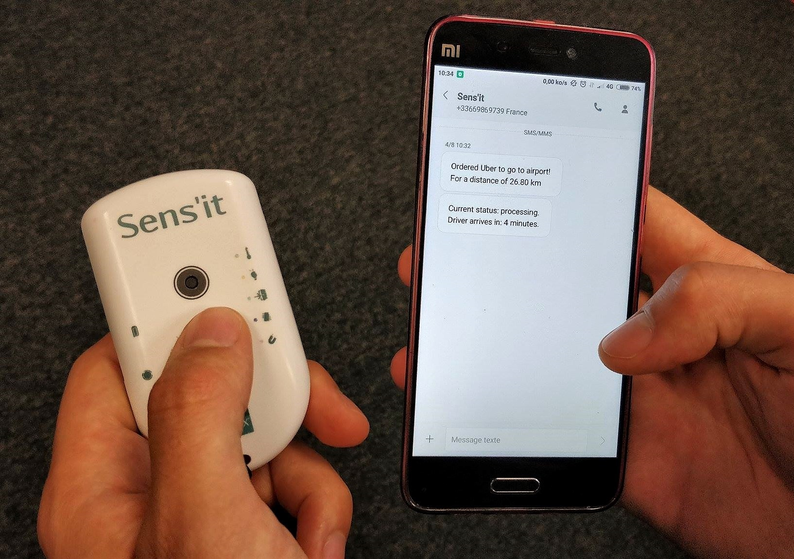

# Sigfox Uber button :car: :radio_button:

Get an __Uber ride__ just by _pressing_ a button!

## Introduction

In this tutorial, we will be using the Sigfox network localization service _(which can, __for now__, give at most a 1km radius position precision)_ in order to get a the closest position to a specified address and request an Uber ride accordingly.
Therefore, we do not need a device with GPS.

We will use a [Sens'it](https://www.sensit.io/?lang=fr) but __any device able to send a message over Sigfox can be used to accomplish this tutorial successfully__.

Have a look __[here](http://makers.sigfox.com/)__ if you wish to have more details regarding Sigfox makers.   

## Hardware
- A [Sens'it](https://www.sensit.io/?lang=fr)

<p align="center">
    
</p>

## The Uber API
We will be automating the ordering process of a ride request by calling Uber API endpoints.

In order to understand how this is possible, please make sure to check out the [node module](https://github.com/AntoinedeChassey/uber-ride-request) I developed for usage simplicity and clarity purposes. You will need an __access token__ to the Uber API for it to work.
The proceedure of how to get this token can be found on __[this](https://github.com/AntoinedeChassey/uber-ride-request)__ GitHub page.

### Prerequisites
- An Uber valid account
- Your Uber API __[access token](https://developer.uber.com/dashboard/) (check above for how to get it)__
- An __activated__ device on the [Sigfox Backend](https://backend.sigfox.com/activate) (follow __[this](https://backend.sigfox.com/activate/sensit)__ link for the Sens'it activation). You will need the device ID and PAC.

### Installation

In `app.js`, two addresses structures will be created as follow (with values defined in environment variables):

```js
const address_1 = {
    'name': process.env.ADDRESS_1_NAME,
    'lat': process.env.ADDRESS_1_LAT,
    'lng': process.env.ADDRESS_1_LNG
};

const address_2 = {
    'name': process.env.ADDRESS_2_NAME,
    'lat': process.env.ADDRESS_2_LAT,
    'lng': process.env.ADDRESS_2_LNG
};
```

These addresses will be used to specify the __pick-up__ and __drop-off__ locations. We will set them later.

If the Sens'it device sends its geo-localized position nearest to address #1, then address #1 is set as pick-up and address #2 is set as drop-off for the ride request.
And so on for the reverse...

If the Sigfox Backend geo-location service returns a __precision radius__ bigger than the __distance between the two addresses__, the Uber request will not be executed _(as the arrival destination can not be determined)_.

#### Deploy on Heroku

I wrote an app using NodeJS to automate the ordering process.
Click the button below to automatically deploy it on Heroku.

[](https://heroku.com/deploy?template=https://github.com/AntoinedeChassey/sigfox_uber)

<p align="center">
    
</p>

An alternative way to get it running at Heroku is to install the [Heroku Cli](https://devcenter.heroku.com/articles/heroku-cli) and follow these steps:

```bash
$ git clone https://github.com/AntoinedeChassey/sigfox_uber.git
$ cd sigfox_uber
$ heroku apps:create <YOUR_APP_NAME>
$ git push heroku master
```

Now, head over to the `settings` tab of your Heroku app (https://dashboard.heroku.com/apps/<YOUR_APP_NAME>/settings) in order to set the environment variables.
Set the following variables (__make sure to set the addresses you wish__):

Name | Value
------------ | -------------
ACCESS_TOKEN | <YOUR_UBER_ACCESS_TOKEN>
ADDRESS_1_LAT | 49.009698
ADDRESS_1_LNG | 2.547882
ADDRESS_1_NAME | airport
ADDRESS_2_LAT | 48.876579
ADDRESS_2_LNG | 2.330618
ADDRESS_2_NAME | office

<p align="center">
    
</p>

The endpoint ".../request/:device/:lat/:lng/:radius" will be called each time a message is sent to the Sigfox Backend (see below how to configure it). By using the Sigfox geolocalization service, the server will receive the Sens'it approximated position.
This will then order an UberX with the determined pick-up and drop-off addresses.

To check if the app is running, go to its URL. You should see "App is running..." on your browser. You can also check the logs for more details.

#### [Optional] Free SMS notifications with a french mobile operator (named Free)
If you have a french Free mobile operator subscription, you can use their free SMS notification API in order to get notifications on your phone.
To make this work, simply activate the service in your subscriber area and refer the following environment variables in the settings tab of your Heroku app:

Name | Value
------------ | -------------
FREE_USER | <YOUR_FREE_USER>
FREE_PASS | <YOUR_FREE_PASS>

You will now be able to receive SMS alerts concerning your UberX requests.

#### Configure the Sigfox Backend Callback

1. Log in __[here](https://backend.sigfox.com/auth/login)__
2. Go to <https://backend.sigfox.com/devicetype/list>, click left on your device row and select "Edit"
3. Now go to the "CALLBACKS" section on the left, select "new" on the top right, select "Custom Callback"
    * Type: `SERVICE` | `GEOLOC`
    * Channel `URL`
    * Url pattern: `https://<YOUR_APP_NAME>.herokuapp.com/request/{device}/{lat}/{lng}/{radius}`
    * Use HTTP Method: `GET`

4. Select "OK" to validate

    <p align="center">
        
    </p>

#### Run to test
By default, the `sandbox` variable is set to `true`. This will fake Uber ride requests so your bank account does not get affected by unintentional manipulations :wink:.

__Press__ the Sens'it button __twice__ to send a message over Sigfox.
Make sure the messages are well received on the [Sigfox Backend](https://backend.sigfox.com/device/list). Log in, go to the __DEVICE__ section and click left on your device Id. You can than go the __MESSAGES__ section to see the payloads.

### Order a real Uber ride
Now set the `sandbox` environment variable to `false` if you wish to request a __real__ Uber driver.

Name | Value
------------ | -------------
SANDBOX | false

* The Sens'it button will call the path `.../request/:device/:lat/:lng/:radius` and trigger the Uber ride request!
* You can also see the current request status on `.../request/current`.
* To cancel an order, this path can be used: `.../request/cancel`.

__Let's drive!__

<p align="center">
    
</p>

Have fun ordering your Ubers! :car: :sunglasses:


> *Antoine de Chassey*
